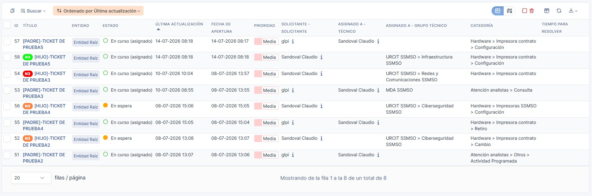
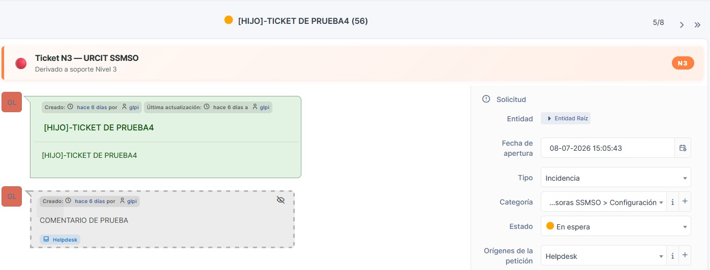
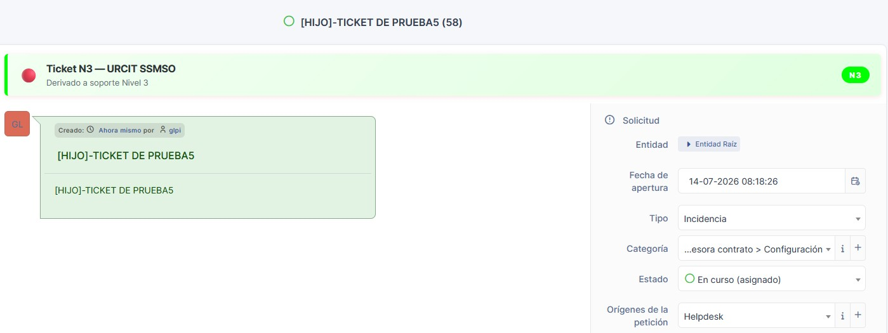
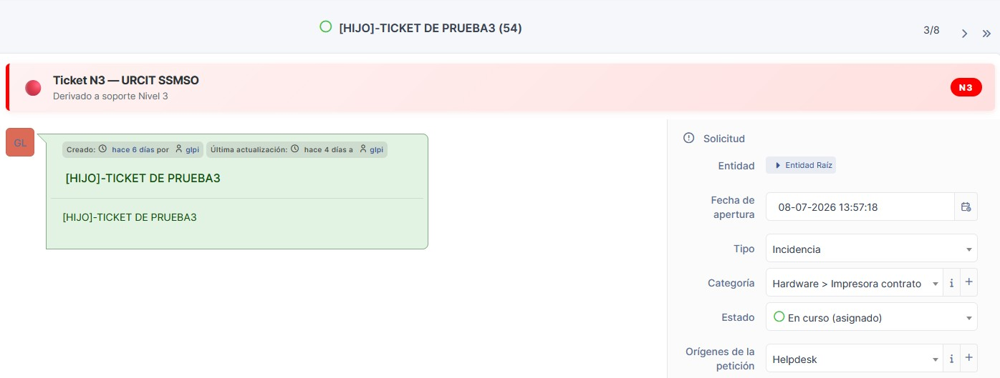
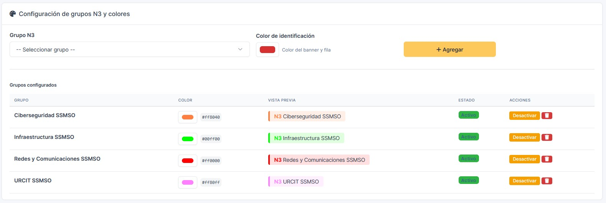

# N3 Indicator — Plugin para GLPI

Plugin para GLPI 11.0.x que identifica visualmente los tickets derivados a soporte de Nivel 3 (N3).

## ¿Qué hace?

- **Badge N3** en el listado de tickets con el color del grupo asignado
- **Banner visual** dentro del ticket indicando escalación a soporte N3
- **Página de configuración** para definir qué grupos son N3 y asignar un color a cada uno
- **Colores dinámicos** — cada grupo N3 puede tener su propio color identificador
- **Activar/desactivar** grupos sin eliminar la configuración

## Capturas

### Bandeja de tickets

### Banner dentro del ticket — Ciberseguridad SSMSO

### Banner dentro del ticket — Infraestructura SSMSO

### Banner dentro del ticket — Redes y Comunicaciones SSMSO

### Página de configuración

## Requisitos

| Componente | Versión |
|---|---|
| GLPI | 11.0.0 – 11.9.9 |
| PHP | 8.1+ |

## Instalación

### Opción 1 — Manual
1. Descargar el ZIP desde [Releases](https://github.com/Maclaud77/n3indicator/releases)
2. Descomprimir en `/glpi/plugins/n3indicator/`
3. Ir a **Configuración → Plugins**
4. Hacer clic en **Instalar** y luego **Activar**

### Opción 2 — Marketplace GLPI
1. Ir a **Configuración → Plugins → Mercado**
2. Buscar **N3 Indicator**
3. Hacer clic en **Instalar**

## Configuración

1. Ir a **Configuración → Plugins**
2. Hacer clic en el ícono de llave (🔧) del N3 Indicator
3. Agregar los grupos que corresponden a soporte N3
4. Asignar un color identificador a cada grupo

## Contexto

Este plugin complementa el flujo nativo de escalamiento de GLPI mediante la funcionalidad "Promocionar a Solicitud". Cuando un ticket requiere la intervención de un equipo de soporte de tercer nivel (N3), GLPI genera un ticket hijo vinculado al ticket original y lo asigna al grupo correspondiente.

El plugin identifica visualmente estos tickets escalados, facilitando su seguimiento, gestión y trazabilidad, sin modificar el comportamiento nativo de GLPI ni el proceso estándar de creación y asignación de tickets.

## Estructura

n3indicator/
├── setup.php
├── hook.php
├── front/config.php
├── inc/ticket.class.php
├── inc/config.class.php
├── js/n3indicator.js
├── css/n3indicator.css
└── locales/es_ES.php
## Licencia

[GPLv2+](LICENSE)

## Autor

**Claudio Valdes V.** — [@Maclaud77](https://github.com/Maclaud77)
